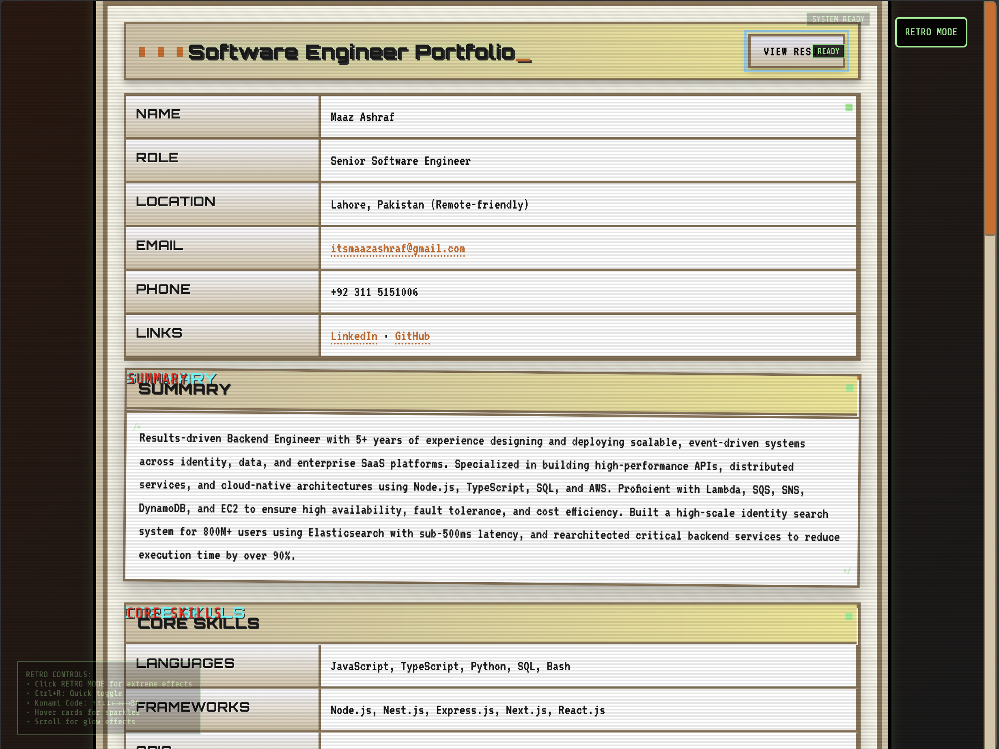

# 🕹️ Maaz Ashraf - Retro Portfolio

A nostalgic, retro-styled software engineer portfolio that feels like it's straight out of the golden age of computing! Built with pure HTML, CSS, and JavaScript.



## ✨ Features

### 🎮 **Retro Aesthetics**

- **CRT scanlines effect** for authentic vintage monitor feel
- **Retro color palette** with browns, creams, and retro accents
- **Terminal-style fonts** (VT323, Orbitron, Press Start 2P)
- **Glowing borders** and 3D effects
- **Blinking cursor** animations

### 🚀 **Interactive Elements**

- **Retro Mode Toggle** - Activate extreme effects
- **Konami Code Easter Egg** - ↑↑↓↓←→←→BA
- **Hover sparkles** on cards
- **Scroll glow effects** and animations
- **Dynamic year update** with retro animation

### 📱 **Responsive Design**

- **Mobile-friendly** retro layout
- **Adaptive grid systems** for all screen sizes
- **Touch-friendly** interactions
- **Print-optimized** styling

### 🎨 **Visual Effects**

- **Loading screen** with retro boot sequence
- **Fade-in animations** for all content
- **Glitch effects** on section titles
- **Hover transformations** and rotations
- **Retro button effects** with ripple animations

## 🛠️ Technologies Used

- **HTML5** - Semantic structure
- **CSS3** - Advanced animations and retro styling
- **Vanilla JavaScript** - Interactive features and effects
- **Google Fonts** - Retro typography
- **CSS Grid & Flexbox** - Modern layout techniques

## 🎯 **Portfolio Sections**

- **Personal Information** - Contact details and links
- **Professional Summary** - Career overview
- **Core Skills** - Technical expertise
- **Work Experience** - Detailed job history
- **Selected Projects** - Key achievements
- **Education** - Academic background

## 🚀 **Getting Started**

1. **Clone the repository**

   ```bash
   git clone <your-repo-url>
   cd experiment-p
   ```

2. **Open in browser**

   - Simply open `index.html` in any modern web browser
   - No build process or dependencies required!

3. **Explore the retro features**
   - Click **RETRO MODE** for extreme effects
   - Try the **Konami Code**: ↑↑↓↓←→←→BA
   - Hover over cards for sparkles
   - Scroll for glow effects

## 🎮 **Retro Controls**

- **RETRO MODE Button** - Toggle extreme retro effects
- **Ctrl+R** - Quick retro mode toggle
- **Konami Code** - Special easter egg activation
- **Hover Effects** - Interactive sparkles and animations
- **Scroll Effects** - Dynamic glow and movement

## 📱 **Browser Compatibility**

- ✅ Chrome (recommended)
- ✅ Firefox
- ✅ Safari
- ✅ Edge
- ⚠️ Internet Explorer (limited support)

## 🎨 **Customization**

The portfolio is built with CSS custom properties (variables) for easy theming:

```css
:root {
  --ink: #1a1a1a;
  --paper: #f8f6e8;
  --chrome: #d4c4a8;
  --stroke: #8b7355;
  --accent: #d2691e;
  --retro-green: #90ee90;
  --retro-blue: #87ceeb;
  --retro-pink: #ffb6c1;
}
```

## 📄 **License**

This project is open source and available under the [MIT License](LICENSE).

## 👨‍💻 **Author**

**Maaz Ashraf** - Senior Software Engineer

- 📧 Email: itsmaazashraf@gmail.com
- 🔗 LinkedIn: [maaz-ashraf](https://www.linkedin.com/in/maaz-ashraf)
- 💻 GitHub: [itsmaazashraf](https://github.com/itsmaazashraf)

## 🌟 **Special Thanks**

- **Retro gaming community** for inspiration
- **CSS animation pioneers** for the techniques
- **Vintage computing enthusiasts** for the aesthetic

---

_Built with ❤️ and lots of retro vibes! 🚀✨_
