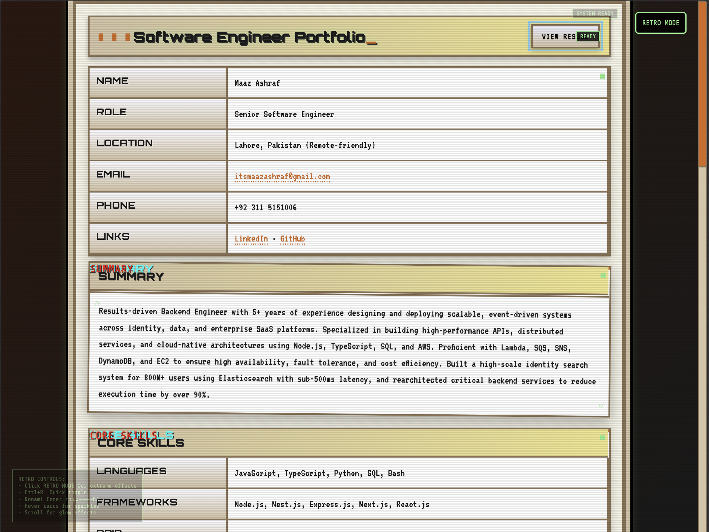

# Maaz Ashraf Portfolio

A very simple one-page personal site for a backend engineer.

## Overview

This version strips the site down to a black-screen, white-text document with almost no visual treatment:

- black background and white monospace text
- plain section anchors and dense content
- no cards, no illustrations, no decorative UI
- almost no JavaScript

## Sections

- Summary
- Selected impact
- Areas
- Technical skills
- Experience
- Selected systems
- Education
- Contact

## Stack

- HTML5
- CSS3
- Vanilla JavaScript

## Local use

Open [index.html](./index.html) in a browser. No build step or dependencies are required.

## Author

Maaz Ashraf
Lead Backend Engineer

- Email: [itsmaazashraf@gmail.com](mailto:itsmaazashraf@gmail.com)
- LinkedIn: [linkedin.com/in/maaz-ashraf](https://www.linkedin.com/in/maaz-ashraf)
- GitHub: [github.com/itsmaazashraf](https://github.com/itsmaazashraf)
