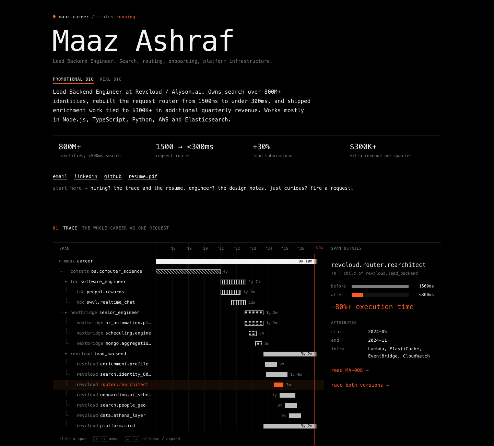

# Maaz Ashraf Portfolio

Personal site for a backend engineer, built around the career as a request trace.

## Overview

The design borrows one idea each from engineers whose personal sites have lasted (see [research/legends.md](./research/legends.md)):

- **01 trace.** The career rendered as a distributed trace waterfall. Click a span for its result, attributes and design note. After Brendan Gregg's interactive flame graphs.
- **02 fire a request.** Race the old router against the rebuilt one at real speed. After Bartosz Ciechanowski's playable explainers.
- **03 design notes.** One numbered note per system, `MA-001` to `MA-012`. After Dijkstra's EWDs and Dan Luu's flat index.
- **Promotional bio / real bio.** After Bret Victor.
- **04 facts.** Some of them are true. After Rob Pike's bio.
- **05 errata.** A small reward for finding a real error. After Knuth's cheques.
- **06 standing invitation.** After Patrick McKenzie.
- **Footer.** Reports the page's own weight and render time.

Black and white monospace with a single orange accent. Works with reduced motion. The design notes and contact details work without JavaScript.

## Editing

- Career spans (trace bars, metrics, links to notes): `SPANS` in [script.js](./script.js).
- Design notes, bios, facts, contact: [index.html](./index.html).
- Router race numbers: `sample` in `initRace` in [script.js](./script.js).

## Stack

HTML, CSS and vanilla JavaScript. No build step, no dependencies, no trackers.

## Local use

Open [index.html](./index.html) in a browser, or serve the folder (`python3 -m http.server`) to see the footer's page-weight readout.

## Author

Maaz Ashraf
Lead Backend Engineer

- Email: [itsmaazashraf@gmail.com](mailto:itsmaazashraf@gmail.com)
- LinkedIn: [linkedin.com/in/maaz-ashraf](https://www.linkedin.com/in/maaz-ashraf)
- GitHub: [github.com/itsmaazashraf](https://github.com/itsmaazashraf)
